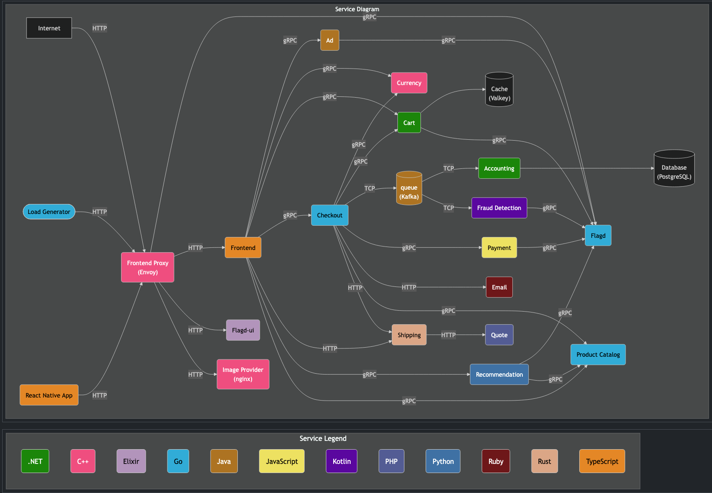
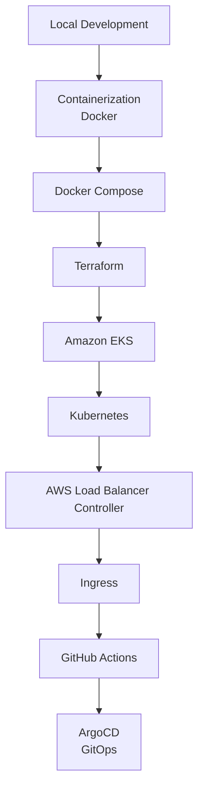
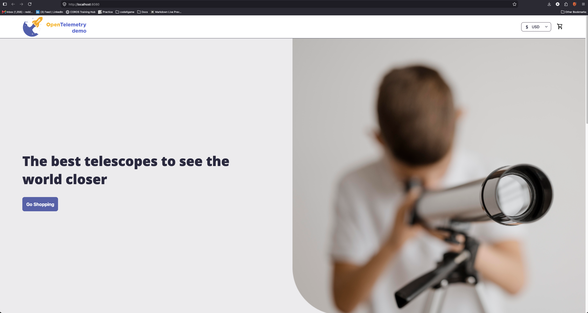
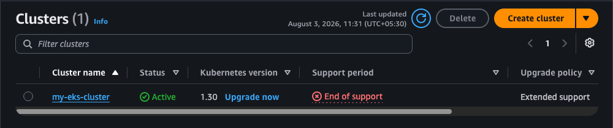
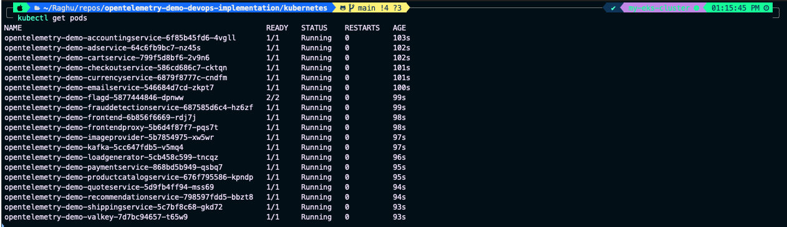
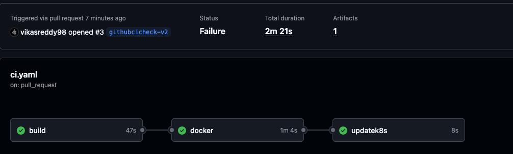
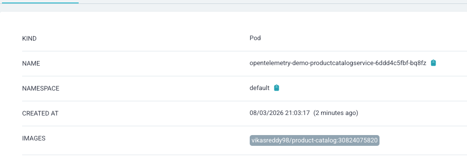

# End-to-End DevOps Implementation of OpenTelemetry Demo on Amazon EKS


> **Note:** The Astronomy Shop application is an open-source microservices application maintained by the OpenTelemetry community. This repository focuses on the **containerization, infrastructure provisioning, Kubernetes deployment, CI/CD implementation, and GitOps workflow** used to deploy the application on Amazon EKS.

---

## Project Overview

This project demonstrates an end-to-end DevOps implementation of the **OpenTelemetry Demo (Astronomy Shop)**, a cloud-native microservices-based e-commerce application designed by the OpenTelemetry community.

The goal of this project is not to develop the application itself, but to showcase the complete DevOps lifecycle—from running the application locally to deploying it on Amazon EKS using Infrastructure as Code, Kubernetes, GitHub Actions, and ArgoCD.

Throughout this implementation, the application was containerized, deployed using Docker Compose for local testing, provisioned on AWS using Terraform, orchestrated with Kubernetes, exposed through AWS Load Balancer Controller and Ingress, and automated using a GitOps-based CI/CD pipeline.

---

## What You'll Learn

- Containerizing microservices using Docker
- Managing multi-container applications with Docker Compose
- Provisioning AWS infrastructure using Terraform
- Deploying workloads on Amazon EKS
- Understanding Kubernetes Deployments, Services, and Service Accounts
- Configuring AWS Load Balancer Controller and Ingress
- Building Continuous Integration pipelines using GitHub Actions
- Implementing Continuous Delivery using ArgoCD and GitOps
- Deploying a production-style microservices application on Kubernetes

---

## Architecture

> *Architecture provided by the OpenTelemetry Project.*

<p align="center">
  
</p>

---

## Tech Stack

| Category | Technologies |
|-----------|--------------|
| Cloud | AWS |
| Infrastructure as Code | Terraform |
| Containerization | Docker, Docker Compose |
| Container Orchestration | Kubernetes (Amazon EKS) |
| CI | GitHub Actions |
| CD / GitOps | ArgoCD |
| Load Balancing | AWS Load Balancer Controller |
| Ingress | Kubernetes Ingress |
| Source Control | Git & GitHub |

---

## Repository Structure

```text
.
├── kubernetes/
├── terraform/
├── src/
├── screenshots/
├── docs/
├── README.md
└── ...
```

---

## Project Documentation

| Documentation | Description |
|---------------|-------------|
| [Architecture](docs/ARCHITECTURE.md) | Solution architecture and request flow |
| [Prerequisites](docs/PREREQUISITES.md) | Required tools and AWS setup |
| [Local Setup](docs/LOCAL-SETUP.md) | Running the application locally |
| [Containerization](docs/CONTAINERIZATION.md) | Building custom Docker images |
| [Docker Compose](docs/DOCKER-COMPOSE.md) | Running the application using Docker Compose |
| [Terraform](docs/TERRAFORM.md) | Infrastructure provisioning on AWS |
| [Kubernetes](docs/KUBERNETES.md) | Deploying workloads on Amazon EKS |
| [Ingress](docs/INGRESS.md) | Configuring external access |
| [CI/CD](docs/CI-CD.md) | GitHub Actions and ArgoCD implementation |
| [Troubleshooting](docs/TROUBLESHOOTING.md) | Errors encountered and their resolutions |
| [Cleanup](docs/CLEANUP.md) | Removing infrastructure and resources |

---

## Deployment Workflow



---

## Project Highlights

- Containerized multiple microservices using Docker
- Built custom Docker images and published them to Docker Hub
- Managed local multi-service deployment using Docker Compose
- Provisioned AWS infrastructure using reusable Terraform modules
- Deployed the application to Amazon EKS
- Configured Kubernetes Deployments, Services, and Ingress
- Exposed the application through AWS Load Balancer Controller
- Implemented CI using GitHub Actions
- Implemented GitOps-based Continuous Delivery using ArgoCD
- Documented the complete deployment process, troubleshooting steps, and cleanup procedures

---

## Project Screenshots

### Local Deployment

<p align="center">
  
</p>

<p align="center">
  <em>Astronomy Shop successfully running locally using Docker Compose.</em>
</p>

---

### Terraform Provisioning

<p align="center">
  
</p>

<p align="center">
  <em>Amazon EKS cluster successfully provisioned using Terraform.</em>
</p>

---

### Kubernetes Deployment

<p align="center">
  
</p>

<p align="center">
  <em>All OpenTelemetry Demo microservices running successfully on Amazon EKS.</em>
</p>

---

### CI/CD Pipeline

<p align="center">
  
</p>

<p align="center">
  <em>GitHub Actions successfully built and published the updated container image.</em>
</p>

---

### GitOps Deployment

<p align="center">
  
</p>

<p align="center">
  <em>ArgoCD synchronized the latest application changes to the Amazon EKS cluster.</em>
</p>

---

## Results

Successfully implemented a complete DevOps workflow for deploying a cloud-native microservices application on Amazon EKS using modern DevOps practices including Infrastructure as Code, containerization, Kubernetes orchestration, CI/CD automation, and GitOps.

---

## Acknowledgements

A special thanks to **Abhishek Veeramalla** for his educational content and guidance, which served as a valuable reference throughout the implementation of this project.

Application Credits: **OpenTelemetry Community** for developing and maintaining the OpenTelemetry Demo (Astronomy Shop) application.
