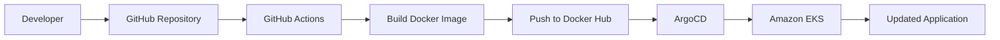
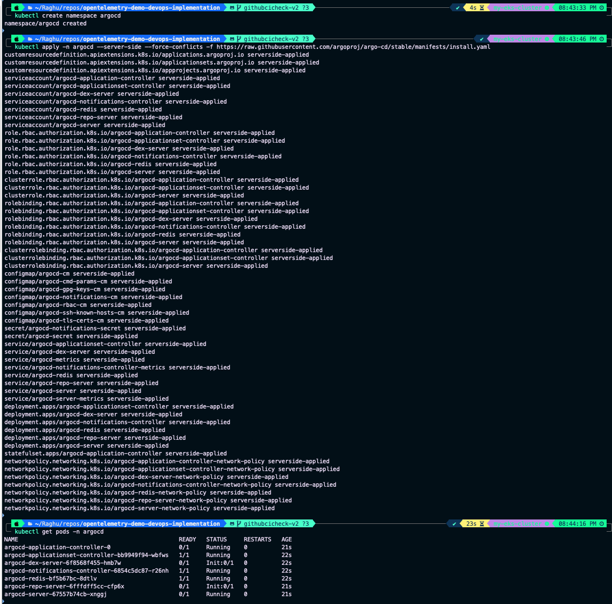
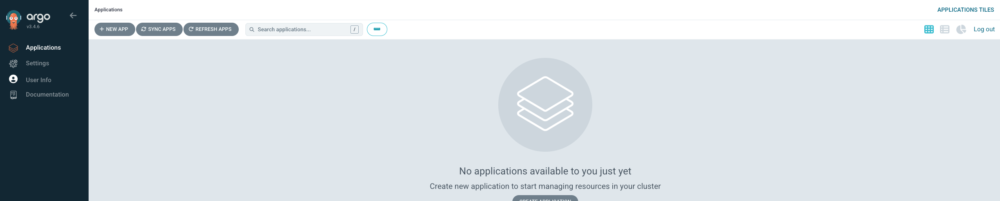

# Implementing CI/CD with GitHub Actions and ArgoCD

## Objective

The final stage of this project focuses on automating application delivery by implementing a Continuous Integration and Continuous Delivery (CI/CD) pipeline.

For this implementation, the pipeline was configured for the **Product Catalog** microservice using:

- **GitHub Actions** for Continuous Integration (CI)
- **ArgoCD** for GitOps-based Continuous Delivery (CD)

This automation ensures that application changes are built, published, and deployed with minimal manual intervention.

---

# Deployment Pipeline



---

# Why CI/CD?

Manual deployments are repetitive and prone to human error.

Implementing CI/CD provides several benefits:

- Automated builds
- Consistent deployments
- Faster release cycles
- Improved reliability
- Version-controlled deployment process

---

# Continuous Integration (GitHub Actions)

GitHub Actions was configured to automatically build and publish updated Docker images whenever changes were merged into the repository.

---

# Workflow Configuration

Create the GitHub Actions workflow directory.

```text
.github/workflows/
```

Create the workflow file.

```text
ci.yaml
```

The workflow is responsible for:

- Checking out the source code
- Building the Docker image
- Authenticating with Docker Hub
- Publishing the updated image

---

# GitHub Secrets

The following repository secrets were configured.

| Secret | Purpose |
|----------|----------|
| DOCKER_USERNAME | Docker Hub username |
| DOCKER_TOKEN | Docker Hub access token |
| GITHUB_TOKEN | GitHub authentication |

These secrets are securely injected into the workflow during execution.

---

# Triggering the Pipeline

A feature branch was created.

```bash
git checkout -b githubcicheck
```

Changes were committed.

```bash
git add .
git commit -m "Trigger CI pipeline"
```

The branch was pushed to GitHub.

```bash
git push origin githubcicheck
```

A Pull Request was created and merged into the target branch.

This triggered the GitHub Actions workflow automatically.

---

# Issues Encountered

## Issue 1

GitHub reported deprecated GitHub Actions versions.

```
Node.js 20 is deprecated
```

### Resolution

Updated the workflow actions.

| Old Version | Updated Version |
|-------------|-----------------|
| actions/checkout@v4 | actions/checkout@v5 |
| docker/setup-buildx-action@v1 | docker/setup-buildx-action@v3 |

---

## Issue 2

```
Docker username and password required
```

### Resolution

The repository secret names did not match the workflow variables.

Updating the variable names resolved the authentication issue.

---

## Issue 3

```
Process completed with exit code 128
```

### Resolution

The GitHub Token variable name was incorrect.

Correcting the repository secret fixed the workflow.

---

# Successful CI Pipeline

After resolving the issues:

- Docker image built successfully
- Image pushed to Docker Hub
- Workflow completed successfully

The updated container image became available for deployment.

---

# Continuous Delivery (GitOps)

Instead of deploying directly from GitHub Actions, this project follows the GitOps model.

ArgoCD continuously monitors the Git repository and synchronizes Kubernetes with the desired application state.

---

# Installing ArgoCD

Create the namespace.

```bash
kubectl create namespace argocd
```

Install ArgoCD.

```bash
kubectl apply \
-n argocd \
--server-side \
--force-conflicts \
-f https://raw.githubusercontent.com/argoproj/argo-cd/stable/manifests/install.yaml
```

---

# Expose the ArgoCD UI

Verify the Services.

```bash
kubectl get svc -n argocd
```

Edit the ArgoCD Server Service.

```bash
kubectl edit svc argocd-server -n argocd
```

Update:

```yaml
type: ClusterIP
```

to

```yaml
type: LoadBalancer
```

After a few minutes, AWS provisions an external Load Balancer.

Access the UI through the generated endpoint.

---

# Retrieve the Initial Password

List the available Secrets.

```bash
kubectl get secrets -n argocd
```

Retrieve the initial admin password.

```bash
kubectl edit secret argocd-initial-admin-secret -n argocd
```

Decode the password.

```bash
echo <base64-password> | base64 --decode
```

Login using:

```
Username: admin
Password: <decoded-password>
```

---

# Create an ArgoCD Application

Within the ArgoCD UI:

- Create a new Application
- Configure the Git repository
- Select the target Kubernetes cluster
- Configure the application path
- Synchronize the application

ArgoCD continuously monitors the Git repository and deploys changes whenever the desired state differs from the cluster state.

---

# Verify Deployment

Verify ReplicaSets.

```bash
kubectl get rs
```

Confirm that the updated application has been deployed successfully.

---

# Screenshots


## Successful Docker Push

<p align="center">
  
</p>

---

## ArgoCD Installation

<p align="center">
  
</p>

---

## ArgoCD Dashboard

<p align="center">
  
</p>

---

## Application Sync

<p align="center">
  
</p>

---


# Summary

In this phase, we successfully:

- Implemented Continuous Integration using GitHub Actions.
- Automated Docker image builds.
- Published updated images to Docker Hub.
- Installed ArgoCD on Amazon EKS.
- Implemented GitOps-based Continuous Delivery.
- Automated Kubernetes deployments using ArgoCD.

This completes the end-to-end DevOps implementation of the OpenTelemetry Demo application.

---

# Next Step

Continue to **[TROUBLESHOOTING.md](TROUBLESHOOTING.md)** for a consolidated list of issues encountered during the implementation and the solutions used to resolve them.