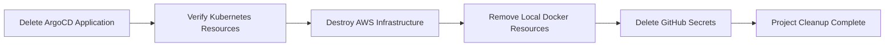

# Cleanup

## Objective

After successfully completing the project, it's important to remove all deployed resources to avoid unnecessary AWS charges and leave the environment in a clean state.

This document outlines the recommended cleanup process for decommissioning the Kubernetes workloads, GitOps components, AWS infrastructure, and local development environment.

---

# Cleanup Workflow



---

# Step 1 — Delete the ArgoCD Application

If the application was deployed using ArgoCD, delete it first.

Use **Cascade Delete** to ensure that all Kubernetes resources managed by ArgoCD are removed automatically.

This removes:

- Deployments
- ReplicaSets
- Pods
- Services
- ConfigMaps
- Other managed Kubernetes resources

---

# Step 2 — Verify Kubernetes Resources

Confirm that the application resources have been deleted.

```bash
kubectl get all
```

You should no longer see the deployed application resources.

If necessary, check all namespaces.

```bash
kubectl get all --all-namespaces
```

---

# Step 3 — Destroy AWS Infrastructure

Navigate to the Terraform root directory.

```bash
cd terraform
```

Destroy all infrastructure created during this project.

```bash
terraform destroy
```

Terraform will display the resources scheduled for deletion.

Type:

```text
yes
```

to confirm.

Terraform removes all managed AWS resources in the correct dependency order.

---

# Step 4 — Verify Resource Deletion

After Terraform completes successfully, verify the following resources have been removed from the AWS Console.

- Amazon EKS Cluster
- Managed Node Group
- Amazon VPC
- Public Subnets
- Private Subnets
- Internet Gateway
- NAT Gateway
- Route Tables
- Security Groups
- Application Load Balancer
- Target Groups

This helps ensure that no billable infrastructure remains.

---

# Step 5 — Remove Local Docker Resources

Remove any unused containers.

```bash
docker container prune
```

Remove unused images.

```bash
docker image prune -a
```

Optionally remove unused volumes.

```bash
docker volume prune
```

Optionally remove unused networks.

```bash
docker network prune
```

This frees local disk space used during development.

---

# Step 6 — Remove GitHub Secrets (Optional)

If the repository will no longer be used, remove sensitive repository secrets.

Examples include:

- DOCKER_USERNAME
- DOCKER_TOKEN
- GITHUB_TOKEN

This is considered a good security practice when archiving projects.

---

# Step 7 — Final Verification

Perform one final verification to ensure the environment has been cleaned successfully.

### AWS

Verify that no infrastructure created for this project remains.

### Kubernetes

```bash
kubectl get all
```

### Docker

```bash
docker ps -a
docker images
```

---

# Cleanup Checklist

- [ ] ArgoCD Application deleted
- [ ] Kubernetes resources removed
- [ ] Terraform infrastructure destroyed
- [ ] AWS resources verified
- [ ] Docker resources cleaned
- [ ] GitHub secrets removed (optional)

---

# Summary

The project environment has now been completely decommissioned.

Following this cleanup process helps:

- Prevent unnecessary AWS charges
- Remove unused Kubernetes resources
- Free local storage
- Reduce security risks
- Leave the environment in a clean and reusable state

---

# Project Complete

Congratulations!

You have successfully completed an end-to-end DevOps implementation of the **OpenTelemetry Demo (Astronomy Shop)** application.

Throughout this project, you implemented:

- Docker containerization
- Docker Compose orchestration
- Infrastructure as Code using Terraform
- Amazon EKS provisioning
- Kubernetes deployments
- AWS Load Balancer Controller
- Kubernetes Ingress
- GitHub Actions CI
- ArgoCD GitOps Continuous Delivery

This project demonstrates the complete lifecycle of deploying and managing a cloud-native microservices application on AWS using modern DevOps practices.