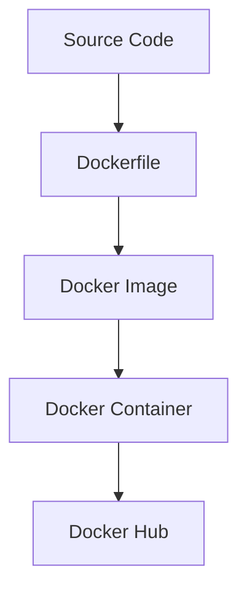
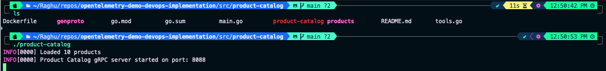
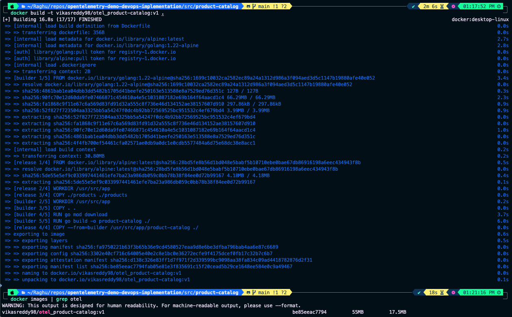
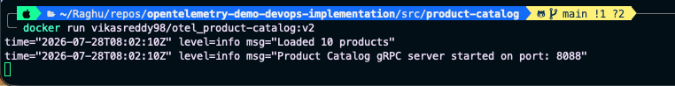
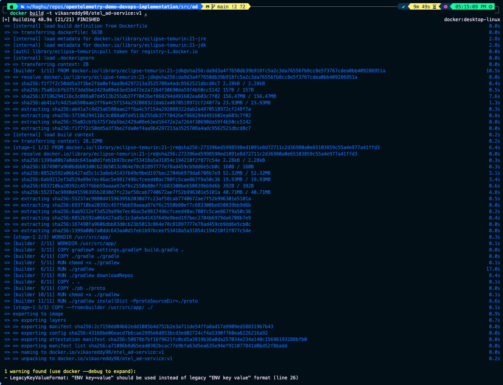
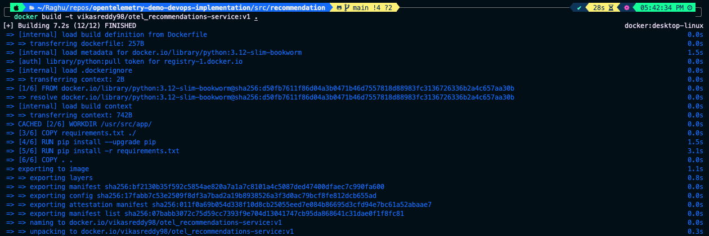
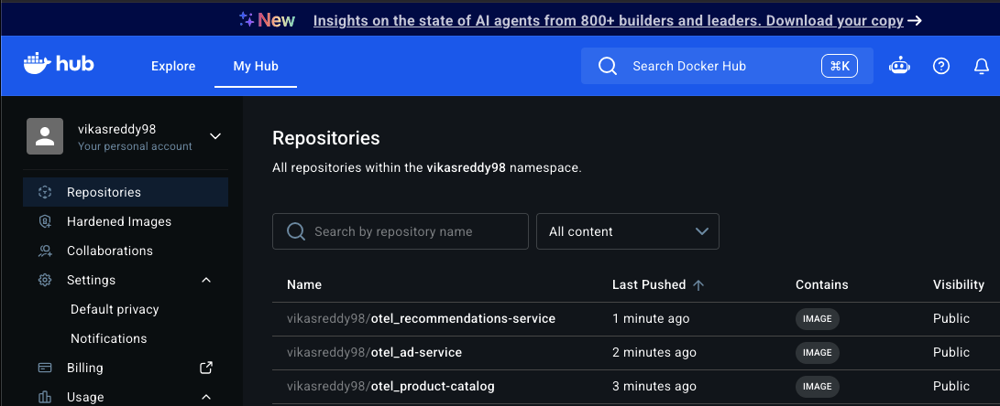

# Containerization

## Objective

In this section, we'll containerize selected microservices from the OpenTelemetry Demo application by creating custom Docker images.

Instead of relying on the Dockerfiles provided by the project, new Dockerfiles are written from scratch to better understand Docker image creation, multi-stage builds, dependency management, and container best practices.

The completed images are then pushed to Docker Hub for later deployment on Kubernetes.

---

# Why Containerization?

Containerization packages an application together with its runtime, dependencies, libraries, and configuration into a portable image.

This provides several advantages:

- Consistent environments across development and production
- Simplified deployments
- Isolation between services
- Easy scalability
- Platform-independent execution

Docker containers also serve as the deployment unit for Kubernetes.

---

# Docker Lifecycle

Each service follows the same workflow.



---

# Microservices Selected

To demonstrate containerization across multiple technology stacks, three different services were selected.

| Service | Language |
|----------|----------|
| Product Catalog | Go |
| Ad Service | Java |
| Recommendation Service | Python |

Each service required a different build process and dependency management strategy.

---

# Product Catalog Service (Go)

## Local Build

Navigate to the service directory.

```bash
cd src/product-catalog
```

Set the application port.

```bash
export PRODUCT_CATALOG_PORT=8088
```

Build the application.

```bash
go build -o product-catalog .
```

Run the application.

```bash
./product-catalog
```

A successful build displays the Product Catalog gRPC server running.

---

## Docker Build

The existing Dockerfile was removed and recreated using a multi-stage build.

The first stage compiles the Go application.

The second stage creates a lightweight runtime image containing only the compiled binary and required assets.

Build the Docker image.

```bash
docker build -t <dockerhub-username>/product-catalog:v1 .
```

Run the container.

```bash
docker run <dockerhub-username>/product-catalog:v1
```

---

## Issue Encountered

```
Environment Variable Not Set:
PRODUCT_CATALOG_PORT
```

### Resolution

The required environment variable was added directly to the Dockerfile.

```Dockerfile
ENV PRODUCT_CATALOG_PORT=8088
```

The image was rebuilt with a new version tag to avoid Docker layer caching.

```bash
docker build -t <dockerhub-username>/product-catalog:v2 .
```

The container started successfully after rebuilding.

---

# Ad Service (Java)

## Local Build

Navigate to the Ad Service.

```bash
cd src/ad
```

Build the project using Gradle.

```bash
./gradlew installDist
```

Run the application after configuring the required environment variables.

The service started successfully.

---

## Docker Build

A multi-stage Dockerfile was created.

The builder stage compiled the Java application using Gradle.

The runtime stage copied only the compiled artifacts into a lightweight JRE image.

Build the image.

```bash
docker build -t <dockerhub-username>/ad-service:v1 .
```

Run the container.

```bash
docker run <dockerhub-username>/ad-service:v1
```

The service started successfully inside the container.

---

# Recommendation Service (Python)

Navigate to the Recommendation Service.

```bash
cd src/recommendation
```

Create a Dockerfile using the official Python 3.12 base image.

Build the image.

```bash
docker build -t <dockerhub-username>/recommendation:v1 .
```

---

## Issue Encountered

During the build process, Docker failed while installing dependencies.

```
Failed to build psutil
```

### Resolution

The project originally referenced an older version of **psutil** that does not support Python 3.12.

The dependency was updated.

```text
psutil>=6.0.0
```

The image built successfully after updating the dependency.

---

# Push Images to Docker Hub

After verifying each container locally, the images were published to Docker Hub.

Login to Docker Hub.

```bash
docker login
```

Verify available images.

```bash
docker images
```

Push each image.

```bash
docker push <dockerhub-username>/<image-name>:<tag>
```

Verify the uploaded images from the Docker Hub repository.

---

# Screenshots

## Product Catalog Local Build

<p align="center">
  
</p>

---

## Product Catalog Docker Build

<p align="center">
  
</p>

---

## Product Catalog Running

<p align="center">
  
</p>

---

## Ad Service Build

<p align="center">
  
</p>

---

## Recommendation Service Build

<p align="center">
  
</p>

---

## Docker Hub Repository

<p align="center">
  
</p>

---

# Summary

In this section, we successfully:

- Built three independent microservices locally.
- Created custom Dockerfiles.
- Implemented multi-stage Docker builds.
- Resolved build issues across multiple language ecosystems.
- Created Docker images.
- Verified container execution.
- Published images to Docker Hub.

The published images will be used during the Kubernetes deployment phase.

---

# Next Step

Continue to **[DOCKER-COMPOSE.md](DOCKER-COMPOSE.md)** to orchestrate the complete application locally using Docker Compose before provisioning cloud infrastructure.