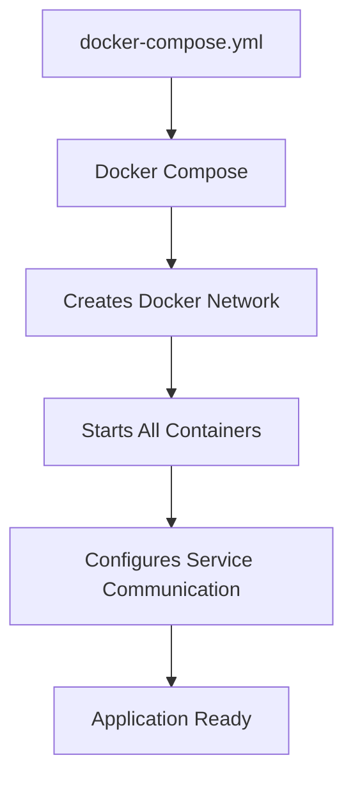
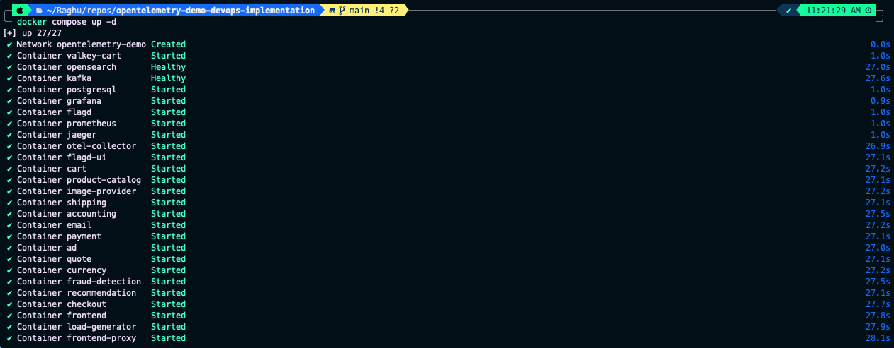
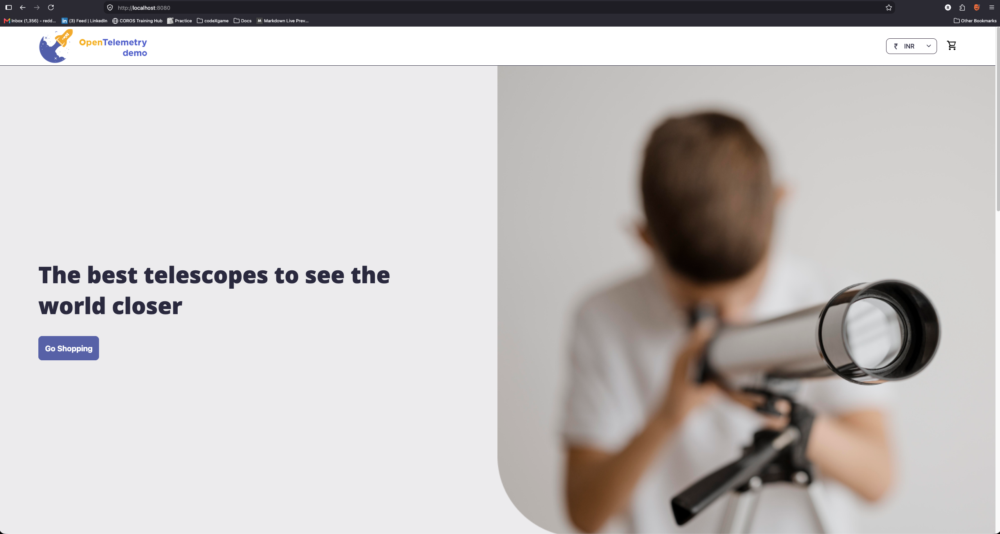

# Docker Compose

## Objective

After containerizing the selected microservices, the next step is to orchestrate the complete OpenTelemetry Demo application using Docker Compose.

Instead of manually creating Docker networks, starting containers one by one, and managing dependencies between services, Docker Compose allows the entire application stack to be deployed with a single command.

This provides a quick and efficient way to validate the application before provisioning cloud infrastructure.

---

# Why Docker Compose?

The OpenTelemetry Demo is composed of multiple microservices that depend on one another.

Starting each container individually would require:

- Creating Docker networks
- Managing container startup order
- Configuring environment variables
- Connecting services manually
- Managing container lifecycle

Docker Compose automates these tasks using a single configuration file.

---

# Docker Compose Architecture



---

# Docker Compose File

The application is orchestrated using a single `docker-compose.yml` file.

The compose file defines:

- Services
- Networks
- Volumes

Each microservice is declared as an independent service while Docker Compose automatically creates the required networking between them.

---

# Stop Existing Containers

Before starting the application, remove any previously running containers.

```bash
docker compose down
```

---

# Deploy the Application

Start all services in detached mode.

```bash
docker compose up -d
```

Docker Compose performs the following tasks automatically:

- Creates the required Docker network
- Starts every microservice
- Connects the services together
- Initializes supporting components
- Runs the application in the background

---

# Verify the Deployment

If running locally:

```text
http://localhost:8080
```

If using an EC2 instance:

```text
http://<EC2-Public-IP>:8080
```

The Astronomy Shop application should now be accessible from your browser.

---

# Verify Running Containers

List all running containers.

```bash
docker ps
```

Verify that all required application containers are in the **Up** state.

---

# Stop the Application

Once testing is complete, stop and remove the containers.

```bash
docker compose down
```

This removes:

- Running containers
- Docker network
- Temporary resources created by Docker Compose

---

# Screenshots


## Running Containers

<p align="center">
  
</p>

---

## Astronomy Shop Running

<p align="center">
  
</p>

---

# Summary

In this section, we successfully:

- Orchestrated the complete microservices application using Docker Compose.
- Deployed all services with a single command.
- Verified successful communication between microservices.
- Confirmed that the application was accessible through the browser.
- Cleaned up the local deployment after testing.

Running the application with Docker Compose provides confidence that the application is functioning correctly before moving to Kubernetes.

---

# Next Step

Continue to **[TERRAFORM.md](TERRAFORM.md)** to provision the AWS infrastructure required for deploying the application to Amazon EKS.