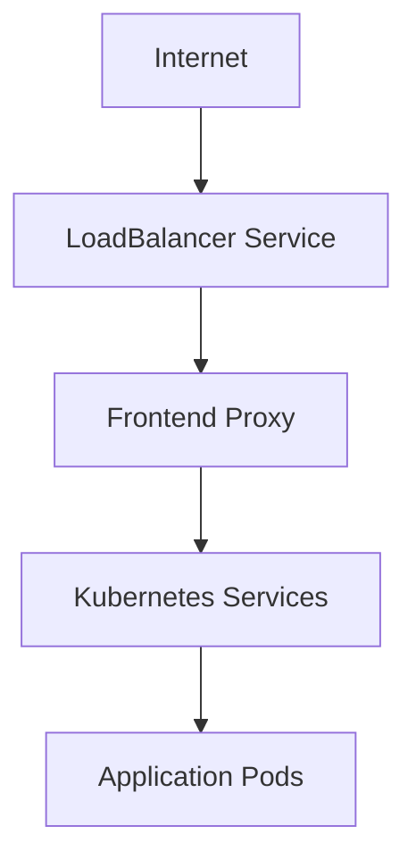
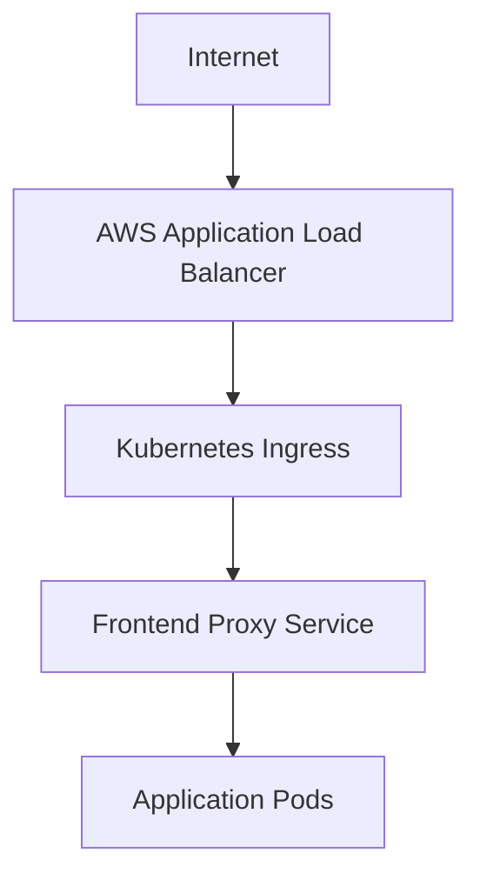
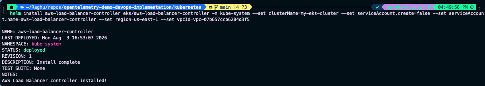
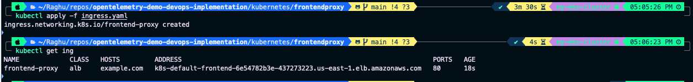

# Configuring Ingress with AWS Load Balancer Controller

## Objective

In the previous section, the application was exposed using a Kubernetes Service of type **LoadBalancer**.

While this approach is suitable for testing, it is not ideal for production workloads.

In this phase, we'll configure the **AWS Load Balancer Controller** and deploy a Kubernetes **Ingress** resource to expose the application through an AWS Application Load Balancer (ALB).

---

# Architecture Before This Step



---

# Architecture After This Step



---

# Why Ingress?

Although Kubernetes Services of type **LoadBalancer** provide external access, they present several limitations.

- Every exposed Service provisions a separate AWS Load Balancer.
- Infrastructure costs increase rapidly.
- Traffic routing capabilities are limited.
- Managing multiple public endpoints becomes difficult.

Ingress solves these challenges by providing a single entry point for external traffic.

Benefits include:

- One Application Load Balancer for multiple services
- Centralized traffic management
- Host-based routing
- Path-based routing
- Declarative configuration through YAML manifests

---

# AWS Load Balancer Controller

The Kubernetes Ingress resource defines routing rules, but it does not create an AWS Application Load Balancer on its own.

The AWS Load Balancer Controller continuously monitors Ingress resources and provisions the required AWS ALB automatically.

The controller acts as the bridge between Kubernetes and AWS.

---

# Associate IAM OIDC Provider

Export the cluster name.

```bash
export cluster_name=<cluster-name>
```

Retrieve the cluster OIDC ID.

```bash
oidc_id=$(aws eks describe-cluster \
--name $cluster_name \
--query "cluster.identity.oidc.issuer" \
--output text | cut -d '/' -f 5)
```

Associate the IAM OIDC provider with the cluster.

```bash
eksctl utils associate-iam-oidc-provider \
--cluster $cluster_name \
--approve
```

---

# Create IAM Policy

Download the AWS Load Balancer Controller IAM policy.

```bash
curl -O https://raw.githubusercontent.com/kubernetes-sigs/aws-load-balancer-controller/v2.11.0/docs/install/iam_policy.json
```

Create the IAM policy.

```bash
aws iam create-policy \
--policy-name AWSLoadBalancerControllerIAMPolicy \
--policy-document file://iam_policy.json
```

---

# Create IAM Service Account

Create the IAM Service Account required by the controller.

```bash
eksctl create iamserviceaccount \
--cluster=<cluster-name> \
--namespace=kube-system \
--name=aws-load-balancer-controller \
--role-name AmazonEKSLoadBalancerControllerRole \
--attach-policy-arn=arn:aws:iam::<account-id>:policy/AWSLoadBalancerControllerIAMPolicy \
--approve
```

---

# Install AWS Load Balancer Controller

Add the EKS Helm repository.

```bash
helm repo add eks https://aws.github.io/eks-charts
```

Update the repository.

```bash
helm repo update eks
```

Install the controller.

```bash
helm install aws-load-balancer-controller \
eks/aws-load-balancer-controller \
-n kube-system \
--set clusterName=<cluster-name> \
--set serviceAccount.create=false \
--set serviceAccount.name=aws-load-balancer-controller \
--set region=us-east-1 \
--set vpcId=<vpc-id>
```

---

# Verify Installation

Verify that the controller Pods are running.

```bash
kubectl get pods -n kube-system
```

Verify the deployment.

```bash
kubectl get deployment -n kube-system aws-load-balancer-controller
```

The deployment should report all replicas in the **Ready** state.

---

# Revert the Frontend Service

Since the Application Load Balancer will now manage external traffic, change the frontend Service back to **NodePort**.

```bash
kubectl edit svc opentelemetry-demo-frontendproxy
```

Update:

```yaml
type: LoadBalancer
```

to

```yaml
type: NodePort
```

Save the changes.

---

# Deploy the Ingress Resource

Navigate to the frontend proxy manifests.

Create the Ingress resource.

```bash
kubectl apply -f ingress.yaml
```

Verify the Ingress.

```bash
kubectl get ingress
```

After a few minutes, Kubernetes will display the external ALB hostname.

---

# Local DNS Mapping

To simplify access during testing, map the ALB endpoint to a friendly domain name.

Retrieve the ALB IP.

```bash
nslookup <domain-name>
```

Edit the hosts file.

```bash
sudo vim /etc/hosts
```

Add an entry similar to:

```text
<ALB-IP>    example.com
```

Save the file.

The application can now be accessed using:

```text
http://example.com
```

---

# Screenshots

## AWS Load Balancer Controller Installation

<p align="center">
  
</p>


---

## Ingress Resource

<p align="center">
  
</p>


---

## Astronomy Shop Accessible Through ALB

<p align="center">
  
</p>

---

# Summary

In this phase, we successfully:

- Associated the IAM OIDC provider with the EKS cluster.
- Created the required IAM policy.
- Created an IAM Service Account for the AWS Load Balancer Controller.
- Installed the controller using Helm.
- Reverted the frontend Service to **NodePort**.
- Deployed a Kubernetes Ingress resource.
- Provisioned an AWS Application Load Balancer automatically.
- Exposed the application through a production-style ingress architecture.

The application is now accessible through an AWS Application Load Balancer managed entirely by Kubernetes.

---

# Next Step

Continue to **[CI-CD.md](CI-CD.md)** to automate application delivery using **GitHub Actions** for Continuous Integration and **ArgoCD** for GitOps-based Continuous Delivery.