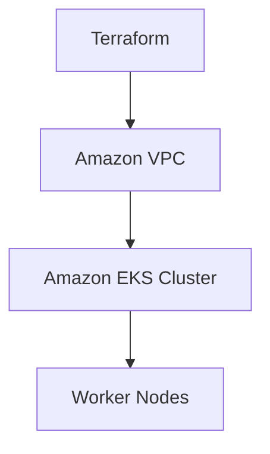
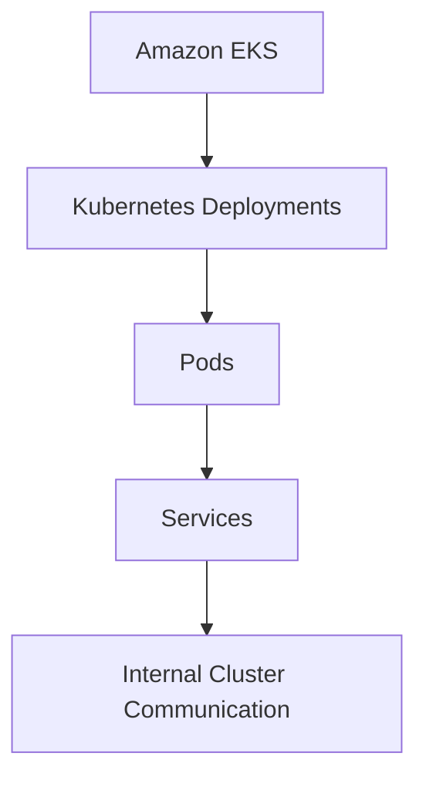
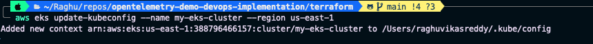
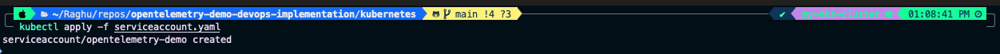
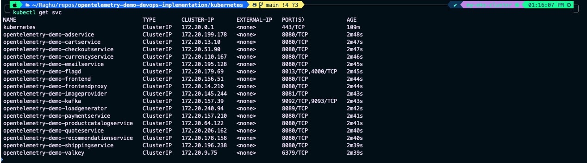
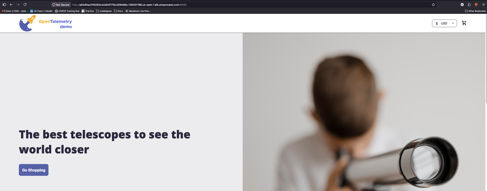

# Deploying the Application on Kubernetes

## Objective

With the AWS infrastructure provisioned successfully, the next step is to deploy the OpenTelemetry Demo application onto the Amazon Elastic Kubernetes Service (EKS) cluster.

In this phase, Kubernetes manifests are used to deploy the application's microservices, establish service discovery, and expose the application internally within the cluster.

---

# Architecture Before This Step



---

# Architecture After This Step



---

# Why Kubernetes?

Managing dozens of containers individually quickly becomes difficult.

Kubernetes automates:

- Container orchestration
- Self-healing
- Scaling
- Service discovery
- Rolling updates
- Load balancing

It provides a consistent platform for running containerized workloads in production.

---

# Configure kubectl

Update the local kubeconfig to communicate with the Amazon EKS cluster.

```bash
aws eks update-kubeconfig \
--name <cluster-name> \
--region us-east-1
```

Verify the current Kubernetes context.

```bash
kubectl config current-context
```

---

# Verify Cluster Connectivity

Ensure communication with the cluster.

```bash
kubectl get all
```

At this stage, only the default Kubernetes resources should be visible.

---

# Kubernetes Resources Used

The deployment uses the following Kubernetes resources.

| Resource | Purpose |
|----------|----------|
| Deployment | Creates and manages Pods |
| ReplicaSet | Maintains desired replica count |
| Pod | Runs application containers |
| Service | Enables service discovery |
| ServiceAccount | Provides pod identity |
| ConfigMap | Stores configuration |
| Secret | Stores sensitive information |

---

# Why Service Accounts?

Applications running inside Kubernetes should never rely on the default Service Account.

Instead, a dedicated Service Account is created and associated with the application.

Benefits include:

- Better security
- Principle of Least Privilege
- Easier IAM integration
- Improved workload isolation

---

# Create the Service Account

Navigate to the Kubernetes manifests.

```bash
cd kubernetes
```

Deploy the Service Account.

```bash
kubectl apply -f serviceaccount.yaml
```

Verify its creation.

```bash
kubectl get sa
```

---

# Deploy the Application

Instead of deploying every microservice individually, all deployment manifests are combined into a single deployment manifest.

Deploy the complete application.

```bash
kubectl apply -f complete-deploy.yaml
```

Kubernetes creates:

- Deployments
- ReplicaSets
- Pods
- Services

for every microservice defined in the manifest.

---

# Verify the Deployment

List the running Pods.

```bash
kubectl get pods
```

Every Pod should eventually reach the **Running** state.

List all Services.

```bash
kubectl get svc
```

At this point, the frontend service is exposed as a **ClusterIP** service.

---

# Understanding ClusterIP

ClusterIP is the default Kubernetes Service type.

Characteristics:

- Accessible only inside the Kubernetes cluster
- Used for service-to-service communication
- Not reachable from the internet

This allows microservices to communicate securely without exposing them externally.

---

# Accessing the Application

To verify the deployment, temporarily expose the frontend service.

Locate the frontend proxy service.

```bash
kubectl get svc | grep frontendproxy
```

Edit the Service.

```bash
kubectl edit svc opentelemetry-demo-frontendproxy
```

Update:

```yaml
type: ClusterIP
```

to

```yaml
type: LoadBalancer
```

Save and exit.

Wait a few minutes while AWS provisions the Application Load Balancer.

Verify the external endpoint.

```bash
kubectl get svc
```

Open the Load Balancer endpoint in your browser.

```text
http://<load-balancer-endpoint>:8080
```

The Astronomy Shop application should now be accessible.

---

# Why We Won't Keep LoadBalancer

Using a Service of type **LoadBalancer** is useful for testing, but it has several limitations.

- Each Service provisions its own AWS Load Balancer.
- Increased infrastructure cost.
- Limited routing capabilities.
- Difficult to manage as applications grow.

For production environments, Kubernetes Ingress provides a much more scalable solution.

The next section replaces the temporary LoadBalancer with an AWS Application Load Balancer managed through Kubernetes Ingress.

---

# Screenshots

## Update kubeconfig

<p align="center">
  
</p>

---

## Service Account Created

<p align="center">
  
</p>

---


## Running Pods

<p align="center">
  
</p>
---

## Kubernetes Services

<p align="center">
  
</p>
---

## Application Running via LoadBalancer

<p align="center">
  
</p>
---

# Summary

In this phase, we successfully:

- Connected to the Amazon EKS cluster.
- Created a dedicated Service Account.
- Deployed all application microservices.
- Verified Deployments, Pods, and Services.
- Confirmed internal service discovery.
- Temporarily exposed the application using a LoadBalancer Service.

The application is now successfully running on Kubernetes.

---

# Next Step

Continue to **[INGRESS.md](INGRESS.md)** to replace the temporary LoadBalancer Service with an AWS Application Load Balancer using Kubernetes Ingress and the AWS Load Balancer Controller.