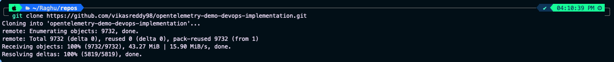

# Local Setup

## Objective

Before deploying the application to Kubernetes, we'll first run it locally using Docker Compose. This helps verify that the application is functioning correctly and provides a baseline before introducing additional infrastructure and orchestration.

---

# Why Run Locally First?

The OpenTelemetry Demo is a distributed microservices application consisting of multiple services that work together to deliver the Astronomy Shop experience.

Running the application locally allows us to:

- Verify that all required services start successfully.
- Confirm that the application is functioning as expected.
- Identify issues early before deploying to AWS.
- Understand the application's architecture before containerizing and orchestrating it.

This serves as the foundation for the remainder of the project.

---

# Clone the Repository

Clone your fork of the OpenTelemetry Demo repository.

```bash
git clone <your-fork-url>
```

Navigate into the project directory.

```bash
cd opentelemetry-demo
```

---

# Start the Application

Since the application consists of multiple microservices, Docker Compose is used to pull the required images and start all services with a single command.

```bash
docker compose up
```

Docker Compose will:

- Pull all required container images
- Create the Docker network
- Start every microservice
- Configure service-to-service communication

The initial startup may take a few minutes depending on your internet connection.

---

# Common Issue

### No Space Left on Device

While pulling the container images, you may encounter the following error:

```text
no space left on device
```

This commonly occurs when running the project on an EC2 instance with limited storage.

### Resolution

Attach an additional EBS volume to the instance or increase the root volume size, then rerun the command.

```bash
docker compose up
```

---

# Verify the Deployment

After all containers have started successfully, verify that the services are running.

If running locally:

```text
http://localhost:8080
```

If using an EC2 instance:

```text
http://<EC2-Public-IP>:8080
```

> **Note:** Ensure that the EC2 Security Group allows inbound traffic on port **8080** before accessing the application.

---

# Expected Outcome

A successful deployment displays the **Astronomy Shop** homepage in your browser.

At this stage, all microservices are running locally through Docker Compose.

---

# Stop the Application

Once verification is complete, stop and remove all running containers.

```bash
docker compose down
```

---

# Screenshots

## Clone the Repository

<p align="center">
  
</p>


---


## Astronomy Shop Running Locally

<p align="center">
  
</p>


---

# Summary

In this section, we successfully:

- Cloned the project repository.
- Started all microservices using Docker Compose.
- Verified the application locally.
- Stopped and removed the containers after testing.

Running the application locally ensures the environment is working correctly before proceeding with container customization and cloud deployment.

---

# Next Step

Continue to **[CONTAINERIZATION.md](CONTAINERIZATION.md)** to build custom Docker images for selected microservices using multi-stage Dockerfiles.