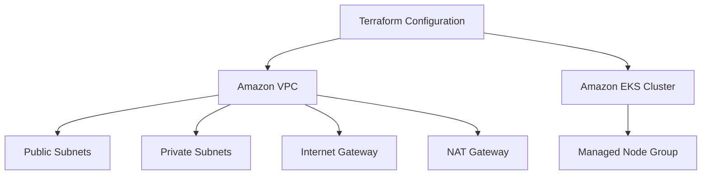
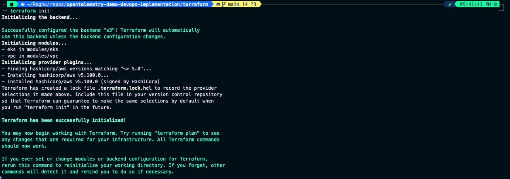
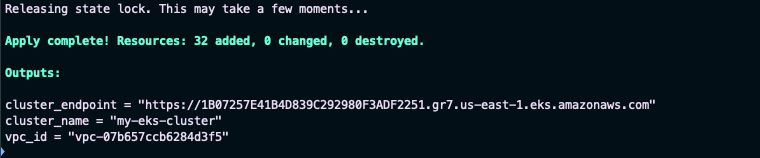
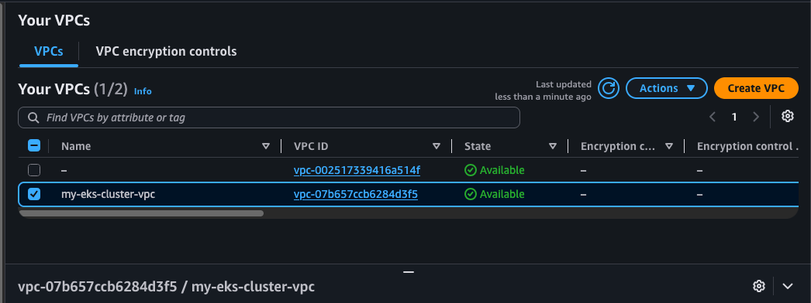

# Infrastructure Provisioning with Terraform

## Objective

With the application validated locally, the next step is to provision the AWS infrastructure required to host it in the cloud.

In this phase, Terraform is used to automate the creation of networking and Kubernetes infrastructure, ensuring the deployment is repeatable, consistent, and version-controlled.

---

# Architecture Before This Step

```text
Local Machine
      │
      ▼
Docker Compose
      │
      ▼
Application Running Locally
```

---

# Architecture After This Step



---

# Why Terraform?

Provisioning cloud resources manually through the AWS Management Console is time-consuming, difficult to reproduce, and prone to configuration drift.

Terraform solves these challenges by allowing infrastructure to be defined as code.

Benefits include:

- Infrastructure as Code (IaC)
- Version-controlled infrastructure
- Repeatable deployments
- Automated provisioning
- Vendor-neutral architecture

---

# Terraform Workflow

Every Terraform deployment follows the same lifecycle.

```text
Write Infrastructure Code
          │
          ▼
terraform init
          │
          ▼
terraform plan
          │
          ▼
terraform apply
          │
          ▼
AWS Infrastructure
```

---

# Project Structure

Terraform files are organized into reusable modules.

```text
terraform/
│
├── backend/
│   └── main.tf
│
├── modules/
│   ├── vpc/
│   └── eks/
│
├── main.tf
├── variables.tf
└── outputs.tf
```

Using modules keeps the infrastructure organized and reusable.

---

# Prerequisites

Before provisioning infrastructure, ensure:

- AWS CLI is installed
- Terraform is installed
- AWS credentials are configured
- Appropriate IAM permissions are available

Verify the AWS CLI installation.

```bash
aws --version
```

Configure AWS credentials.

```bash
aws configure
```

Terraform automatically uses the credentials stored under:

```text
~/.aws/
```

---

# Backend Configuration

Terraform state should be stored remotely to improve reliability and support team collaboration.

For this project, Terraform provisions:

- Amazon S3 Bucket (State Storage)
- DynamoDB Table (State Locking)

Navigate to the backend configuration.

```bash
cd terraform/backend
```

Initialize Terraform.

```bash
terraform init
```

Review the execution plan.

```bash
terraform plan
```

Provision the backend resources.

```bash
terraform apply
```

---

# Issue Encountered

Terraform failed while creating the S3 bucket.

```
The requested bucket name is not available.
```

### Resolution

Amazon S3 bucket names are globally unique.

The bucket name was updated to a unique value before reapplying the configuration.

```bash
terraform apply
```

The backend resources were successfully created.

---

# Creating Reusable Modules

To improve maintainability, the infrastructure was divided into reusable modules.

## VPC Module

Responsible for creating:

- Amazon VPC
- Public Subnets
- Private Subnets
- Internet Gateway
- NAT Gateway
- Route Tables

Files:

```text
modules/vpc/

main.tf
variables.tf
outputs.tf
```

---

## Amazon EKS Module

Responsible for provisioning:

- Amazon EKS Cluster
- Worker Nodes
- Security Groups
- IAM Resources

Files:

```text
modules/eks/

main.tf
variables.tf
outputs.tf
```

---

# Root Module

The root Terraform configuration combines both modules to provision the complete infrastructure.

Files:

```text
terraform/

main.tf
variables.tf
outputs.tf
```

This approach keeps the infrastructure modular and easier to maintain.

---

# Provision Infrastructure

Return to the Terraform root directory.

```bash
cd terraform
```

Initialize Terraform.

```bash
terraform init
```

Review the execution plan.

```bash
terraform plan
```

Create the infrastructure.

```bash
terraform apply
```

Provisioning the complete infrastructure may take approximately **20–30 minutes**.

---

# Verify Infrastructure

After a successful deployment, verify the following resources in the AWS Console:

- Amazon VPC
- Public & Private Subnets
- Internet Gateway
- NAT Gateway
- Amazon EKS Cluster
- Node Group
- Security Groups

Terraform should also report a successful apply operation.

---

# Screenshots

## Terraform Initialization

<p align="center">
  
</p>

---


## Terraform Apply

<p align="center">
  
</p>

---

## Amazon VPC

<p align="center">
  
</p>

---

## Amazon EKS Cluster

<p align="center">
  
</p>

---


# Summary

In this phase, we successfully:

- Configured Terraform for AWS.
- Provisioned a remote backend using Amazon S3 and DynamoDB.
- Created reusable Terraform modules.
- Provisioned networking resources.
- Created an Amazon EKS cluster.
- Automated the entire infrastructure deployment using Infrastructure as Code.

The cloud infrastructure is now ready to host the Kubernetes workloads.

---

# Next Step

Continue to **[KUBERNETES.md](KUBERNETES.md)** to deploy the OpenTelemetry Demo application onto the Amazon EKS cluster.